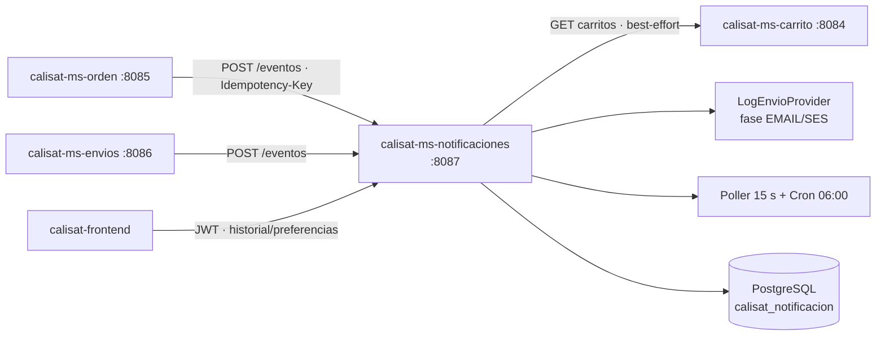

# calisat-ms-notificaciones

> Microservicio Spring Boot de notificaciones: ingesta idempotente de eventos, cola con reintentos y backoff, plantillas, preferencias de campaña y cron de carritos abandonados.


**Versión actual: `2.0.0`** (definida en `pom.xml` · historial en [`CHANGELOG.md`](CHANGELOG.md))

---

## 📑 Índice

- [📋 Descripción general](#-descripción-general)
- [✨ Características principales](#-características-principales)
- [🏗️ Arquitectura](#-arquitectura)
- [🚀 Requisitos](#-requisitos)
- [⚙️ Configuración](#-configuración)
- [▶️ Ejecución local](#-ejecución-local)
- [📡 Endpoints principales](#-endpoints-principales)
- [🗃️ Modelo de datos](#-modelo-de-datos)
- [🔒 Seguridad](#-seguridad)
- [🧪 Tests](#-tests)
- [📦 Despliegue](#-despliegue)
- [🔗 Microservicios relacionados](#-microservicios-relacionados)
- [📄 Licencia y modo académico](#-licencia-y-modo-académico)

---

## 📋 Descripción general

**calisat-ms-notificaciones** es el canal de comunicación de la plataforma Calisat. La tabla `notificacion` funciona a la vez como **cola de salida (outbox)** y como **historial consultable**: se ingesta una notificación `PENDIENTE` (desde otros microservicios o envío directo) y un **poller programado** la despacha cuando vence su `proximo_intento_at`.

Características centrales:

- **Ingesta idempotente** por cabecera `Idempotency-Key` (una clave repetida devuelve la notificación original sin duplicar).
- **Control de reintentos**: máximo 5 intentos con *backoff*; estados `PENDIENTE → ENVIANDO → ENVIADO / REINTENTO / FALLIDO`.
- **Plantillas** con render simple `{{var}}` (sin Thymeleaf), versionadas y con baja lógica.
- **Preferencias de campaña** opt-in/out por usuario.
- **Cron de carritos abandonados** (diario 06:00) que consulta `calisat-ms-carrito` e ingesta avisos transaccionales.
- **Proveedor de envío por log** (`LogEnvioProvider`); el canal `EMAIL` vía AWS SES queda para fase posterior.

## ✨ Características principales

- 🔁 **Ingesta idempotente** de eventos entre microservicios (`Idempotency-Key` única).
- 📨 **Envío directo** transaccional scopeado al usuario autenticado (`sub` del JWT).
- ⏱️ **Poller `@Scheduled`** cada 15 s que despacha notificaciones `PENDIENTE`/`REINTENTO` con `proximo_intento_at` vencido.
- 🔁 **Reintentos con backoff**: `max_intentos = 5` por defecto; reintento manual (`POST /{id}/reintentar`) desde `FALLIDO`/`REINTENTO`/`CANCELADO`.
- 🧾 **Historial paginado** con filtro opcional por estado y traza completa de intentos (`IntentoEnvio`).
- 📝 **CRUD de plantillas** con código único, variables en JSON, control de versión y baja lógica (`activa=false`).
- ⚙️ **Preferencias de campaña** (opt-in/out) por usuario.
- 👥 **Directorio de destinatarios** con baja lógica (bounces, etc.).
- 🕗 **Cron de carritos abandonados** (06:00, diario): carritos `ABIERTO` sin actualización ≥ 30 días → aviso transaccional idempotente (`carrito-abandonado-{carritoId}`).
- 📕 **OpenAPI 3 + Swagger UI** · 🩺 **Actuator** · 🐳 **Docker multi-stage**.
- 🧪 **18 tests** (servicio, plantillas, cron y cliente de carrito mockeado).

## 🏗️ Arquitectura



### Estructura de paquetes

```
com.califorge.msnotificaciones
├── client/        # CarritoClient (RestTemplate)
├── config/        # SecurityConfig, RestTemplateConfig, CORS
├── controller/    # NotificacionController, PreferenciaController,
│                  # PlantillaController, DestinatarioController
├── dto/           # NotificacionRequest/Response, Plantilla*, Preferencia*, ...
├── exception/     # GlobalExceptionHandler, PlantillaNoEncontradaException, ...
├── model/         # Notificacion, Plantilla, Destinatario, Suscripcion,
│                  # IntentoEnvio, Canal, TipoNotificacion, EstadoNotificacion
├── provider/      # EnvioProvider, LogEnvioProvider, ResultadoEnvio
├── repository/    # NotificacionRepository, PlantillaRepository, ...
├── scheduler/     # NotificacionPoller, CarritoAbandonadoScheduler
└── service/       # NotificacionService, PlantillaService, PreferenciaService, ...
```

## 🚀 Requisitos

| Requisito | Versión mínima |
|-----------|----------------|
| JDK | **21+** (enforcer) |
| Maven | 3.6.3+ (o wrapper `./mvnw`) |
| Docker + Docker Compose | 24+ |
| Servicio opcional | `calisat-ms-carrito` (:8084) para el cron de abandonos |

## ⚙️ Configuración

Valores de `src/main/resources/application.yaml`, `docker-compose.yml` y variables de cliente:

| Parámetro | Valor |
|-----------|-------|
| **Puerto del servicio** | **`8087`** (`application.yaml`; Compose publica `8087:8080` con `SERVER_PORT=8080` en contenedor) |
| Base de datos | PostgreSQL · `calisat_notificacion` |
| Host de BD (local) | `localhost:5436` (Compose publica `5436:5432`) |
| Usuario / contraseña BD | `postgres` / `postgres` *(solo académico)* |
| `ddl-auto` | `update` |
| JWT *issuer* | `https://login.microsoftonline.com/e5372bf0-c5e3-4286-887c-79069f209c1f/v2.0` |
| JWT *audience* | `d221f0d2-1a7c-4872-ad6c-367a1f0717ec` |
| Rutas públicas | `/actuator/health`, `/swagger-ui/**`, `/v3/api-docs/**` |
| Poller de despacho | `fixedDelay = 15000` ms (15 s) |
| Cron de abandonos | `0 0 6 * * *` (diario 06:00) |
| Máx. reintentos | `5` (backoff) |

### Variables de integración (cliente)

| Variable | Defecto | Servicio consumido |
|----------|---------|--------------------|
| `CALISAT_CARRITO_URL` | `http://localhost:8084` | `calisat-ms-carrito` (cron de abandonos) |

> ⚠️ **Modo académico**: issuer, audience y credenciales están **hardcodeados**; en producción deben externalizarse. El proveedor de envío actual es `LogEnvioProvider` (logging); `EMAIL`/AWS SES es una mejora futura.

## ▶️ Ejecución local

### 1. Base de datos

```bash
docker compose up -d postgres-db
```

Levanta PostgreSQL 15 publicado en `localhost:5436`.

### 2. Aplicación

```bash
# Windows
mvnw.cmd spring-boot:run

# Linux / macOS
./mvnw spring-boot:run
```

### 3. Docker Compose

```bash
docker compose up --build
```

Servicio en `http://localhost:8087` (Swagger: `/swagger-ui.html`).

## 📡 Endpoints principales

### Notificaciones — `http://localhost:8087/api/v1/notificaciones`

| Método | Ruta | Descripción | Auth |
|--------|------|-------------|------|
| `POST` | `/api/v1/notificaciones/eventos` | Ingesta idempotente desde otros MS (`Idempotency-Key`; `201`) | JWT |
| `POST` | `/api/v1/notificaciones/enviar` | Envío directo del usuario autenticado (`201` + `Location`) | JWT |
| `GET` | `/api/v1/notificaciones` | Historial paginado con filtro opcional por `estado` | JWT |
| `GET` | `/api/v1/notificaciones/mis-notificaciones` | Notificaciones propias (`sub` del JWT), paginadas | JWT |
| `GET` | `/api/v1/notificaciones/{id}` | Detalle con traza completa de intentos (404 si no existe) | JWT |
| `POST` | `/api/v1/notificaciones/{id}/reintentar` | Forzar reintento desde `FALLIDO`/`REINTENTO`/`CANCELADO` (409 si el estado no lo permite) | JWT |

### Preferencias — `/api/v1/preferencias`

| Método | Ruta | Descripción | Auth |
|--------|------|-------------|------|
| `GET` | `/api/v1/preferencias` | Suscripciones a campañas del usuario (opt-in `false` por defecto) | JWT |
| `PUT` | `/api/v1/preferencias` | Upsert de preferencias (opt-in explícito) | JWT |

### Plantillas — `/api/v1/plantillas`

| Método | Ruta | Descripción | Auth |
|--------|------|-------------|------|
| `GET` | `/api/v1/plantillas` | Listar todas las plantillas | JWT |
| `GET` | `/api/v1/plantillas/{codigo}` | Obtener plantilla por código (404 si no existe) | JWT |
| `POST` | `/api/v1/plantillas` | Crear plantilla (versión 1; `201` + `Location`; 400 si el código existe) | JWT |
| `PUT` | `/api/v1/plantillas/{codigo}` | Actualizar plantilla e incrementar versión (404 si no existe) | JWT |
| `DELETE` | `/api/v1/plantillas/{codigo}` | Baja lógica (`activa=false`; `204`) | JWT |

### Destinatarios — `/api/v1/destinatarios`

| Método | Ruta | Descripción | Auth |
|--------|------|-------------|------|
| `GET` | `/api/v1/destinatarios` | Directorio de destinatarios ordenado por nombre | JWT |

**Total: 14 endpoints** (4 controladores) · *Swagger UI*: `/swagger-ui.html`

### Ejemplo

```bash
# Ingesta idempotente de un evento (desde ms-orden / ms-envios)
curl -X POST http://localhost:8087/api/v1/notificaciones/eventos \
  -H "Authorization: Bearer $TOKEN" \
  -H "Content-Type: application/json" \
  -H "Idempotency-Key: orden-3f1c-ORDEN_CONFIRMADA" \
  -d '{"destinatarioSub":"…","asunto":"Orden confirmada","cuerpoTexto":"Tu orden fue confirmada.","tipo":"TRANSACCIONAL"}'

# Consultar seguimiento público no aplica aquí: todo requiere JWT
```

### Errores de dominio

| Código | Excepción | Condición |
|--------|-----------|-----------|
| `404` | `NotificacionNoEncontradaException` / `PlantillaNoEncontradaException` | Recurso inexistente |
| `400` | `PlantillaDuplicadaException` | Código de plantilla ya registrado |
| `409` | `TransicionEstadoNoPermitidaException` | Reintento en estado que no lo permite |

## 🗃️ Modelo de datos

### Entidad `Notificacion` (tabla `notificacion`)

| Campo | Tipo | Restricciones |
|-------|------|---------------|
| `id` | `UUID` | PK |
| `destinatario_sub` / `destinatario_email` / `destinatario_nombre` | `String` | Snapshot del destinatario |
| `canal` | `Enum` | `EMAIL` (default), `SMS`, `PUSH`, `IN_APP` |
| `tipo` | `Enum` | `TRANSACCIONAL` (default), `CAMPANA`, `SISTEMA` |
| `asunto` / `cuerpo_texto` / `cuerpo_html` | `String`/`text` | Contenido |
| `estado` | `Enum` | `PENDIENTE` (default) · ver máquina de estados |
| `idempotency_key` | `String(100)` | **Único**, nullable |
| `intentos` / `max_intentos` | `Integer` | Default `0` / `5` |
| `proximo_intento_at` | `LocalDateTime` | Ventana del siguiente intento (backoff) |
| `ses_message_id` | `String(100)` | Reservado para AWS SES (fase posterior) |
| `payload_json` / `origen_ms` / `correlacion_id` | `String`/`text` | Auditoría y correlación |
| `fecha_creacion` / `fecha_actualizacion` | `LocalDateTime` | `@PrePersist` / `@PreUpdate` |

**Máquina de estados**: `PENDIENTE → ENVIANDO → ENVIADO / REINTENTO (backoff, máx. 5) / FALLIDO`; `CANCELADO` y `OMITIDO` son terminales de baja.

### Otras entidades

| Entidad | Tabla | Claves |
|---------|-------|--------|
| `Plantilla` | `plantilla` | `codigo` **único**, `asunto`, cuerpos, `variables` (JSON), `activa`, `version` |
| `Destinatario` | `destinatario` | `azure_sub` **único**, `email`, `nombre`, `rol`, `activo` (baja lógica) |
| `Suscripcion` | — | Opt-in/out de campañas por usuario (`tipo`/`canal`) |
| `IntentoEnvio` | — | Traza por intento de despacho (`numero_intentos`, resultado) |

## 🔒 Seguridad

- **JWT (OAuth2 Resource Server)** de **Microsoft Entra ID**: validación de *issuer* + *audience*.
- **Sin RBAC**: cualquier usuario autenticado; el *scope* por usuario se resuelve con `sub` del JWT (*modo académico, usuario genérico*).
- **Rutas públicas**: `/actuator/health` y Swagger UI; el resto (incluido el historial) exige token.
- **CSRF deshabilitado** · **CORS** restringido al origen del despliegue (incluye la cabecera `Idempotency-Key`).

## 🧪 Tests

```bash
./mvnw test
```

| Suite | Archivos | Tests |
|-------|----------|-------|
| Unitarios | `NotificacionServiceTest` (8), `CarritoAbandonadoSchedulerTest` (4), `PlantillaServiceTest` (4), `CarritoClientTest` (2) | **18** |

## 📦 Despliegue

### Docker

```bash
docker build -t calisat-ms-notificaciones:2.0.0 .
docker run -p 8087:8080 --name calisat-ms-notificaciones calisat-ms-notificaciones:2.0.0
```

**Dockerfile multi-stage:**

1. `maven` (Temurin 21) → `mvn clean package`.
2. `eclipse-temurin:21-jre-alpine` → JAR con usuario no root, `MaxRAMPercentage=75`, `HEALTHCHECK` en `/actuator/health`.

### Docker Compose

```bash
docker compose up --build
```

Levanta PostgreSQL 15 (`calisat_notificacion`, puerto host `5436`) + app en **8087**, red `calisat-net`.

## 🔗 Microservicios relacionados

| Repositorio | Relación |
|-------------|----------|
| [calisat-ms-orden](https://github.com/DavNat13/calisat-ms-orden) | **Productor**: eventos `ORDEN_CONFIRMADA`/`ORDEN_CANCELADA` → `POST /eventos` (`:8087`) |
| [calisat-ms-envios](https://github.com/DavNat13/calisat-ms-envios) | **Productor**: eventos `ENVIO_DESPACHADO`/`ENVIO_ENTREGADO` → `POST /eventos` (`:8087`) |
| [calisat-ms-carrito](https://github.com/DavNat13/calisat-ms-carrito) | **Dependencia**: el cron de abandonos consulta carritos vía `CarritoClient` (`CALISAT_CARRITO_URL`, `:8084`) |
| [calisat-ms-catalogo](https://github.com/DavNat13/calisat-ms-catalogo) | Catálogo de productos (puerto 8082) |
| [calisat-ms-inventario](https://github.com/DavNat13/calisat-ms-inventario) | Stock y reservas (puerto 8083) |
| [calisat-ms-usuarios](https://github.com/DavNat13/calisat-ms-usuarios) | Perfil y direcciones (puerto 8081) |
| [calisat-frontend](https://github.com/DavNat13/calisat-frontend) | SPA React 19 (v1.4.0) |

## 📄 Licencia y modo académico

Proyecto desarrollado en **modo académico**; sin licencia open source formal. Issuer, audience y credenciales están *hardcodeados* con fines educativos; sin RBAC (usuario genérico autenticado) y sin service discovery (URLs por variables de entorno). El despacho real por email (AWS SES) queda fuera de esta fase: el proveedor actual es de logging.

- **Versión actual**: `2.0.0` — *breaking change*: `CarritoAbandonadoScheduler` añadido al contexto con `CarritoClient`, `DestinatarioService` y `NotificacionService`
- **Historial de cambios**: [`CHANGELOG.md`](CHANGELOG.md)
